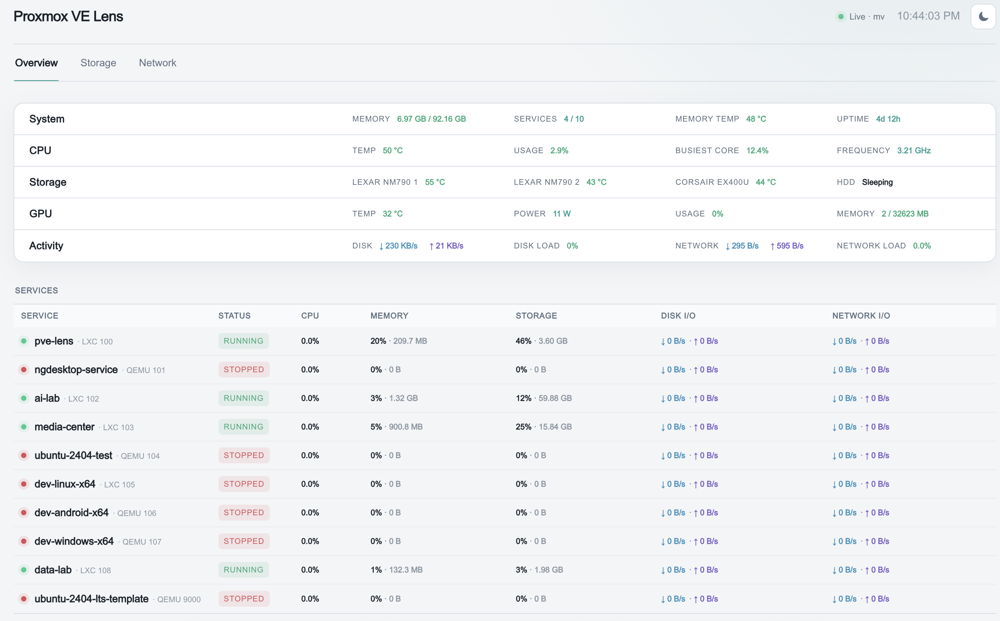

# Proxmox VE Lens

A compact dashboard for understanding a Proxmox host at a glance: system health, service activity, physical storage topology and network traffic.

[](docs/images/overview.png)

## Views

- [Storage](docs/storage.md) maps physical disks to pools, volumes and virtual-machine storage.
- [Network](docs/network.md) shows physical links, throughput, link load and per-service traffic.

## Design

The host collector is read-only and publishes a small atomic JSON snapshot. The web interface consumes that snapshot without receiving a Proxmox API token, an SSH key or writable access to the host.

Live telemetry remains volatile and does not accumulate on disk. SMART polling is restricted to solid-state storage so monitoring cannot wake a sleeping rotational disk.

The current release is observational. A storage-management module is planned as a separate, explicitly controlled capability.

## Components

- `collector/collector.py` — lightweight host collector using the Python standard library.
- `app/` — responsive dashboard and snapshot API route.
- `systemd/` — hardened service definitions and bounded release cleanup.

## Checks

```bash
python3 -m py_compile collector/collector.py
npm run lint
npm run build
npm audit --omit=dev
```
