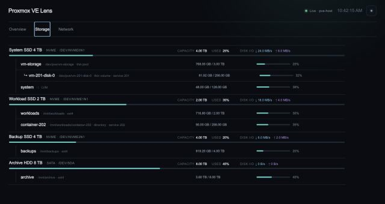

# Storage

The Storage view keeps physical devices, logical allocation and measured usage visibly separate.

Volume rows keep the name, mount point or device path, and storage type together on one line.

The current implementation is read-only. Storage-management operations are planned as a separate capability with explicit safeguards.

[Back to overview](../README.md)
